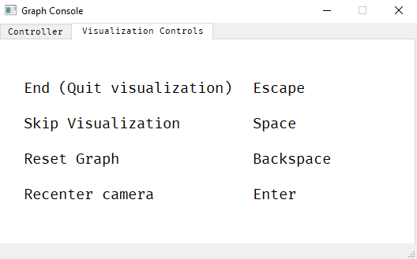

# graph-generator
A graph generator using the Erdős-Rényi random graph generation model - made in pygame, and a console in pyqt5.

Sources:
* <https://youtu.be/PvYwkFsHFg8> 
* <http://www.sciweavers.org/free-online-latex-equation-editor>
  * This is for the mathematical equations 

## Generation

### The Erdős-Rényi random graph generation model
* completely unbiased randomization
* You are given the following parameters:
  * The number of nodes (***n***)
  * The probability threshold of an edge (***p***)
* randomly create ***n*** nodes (possibly by assigning a random *(x, y)* co-ordinate to each node)
* join up every node with every other node in the network, creating a full mesh
  * there are *n(n-1)* possible edges, but we must divide by *2!* (which is just *2*) to remove the duplicate connections


* go through every single edge, and generate a random number (***r***) where *0 ≤ **r** ≤ 1*

* if ***r < p***, the edge is ignored, else, the edge is kept
* this should leave us with a graph with ***n*** nodes, and approximately this many connections:


##### NOTE: maybe the number of edges (***e***) is given instead, however ***p*** can be calculated by using the maximum number of edges, however some compensation will have to be done, as doing the method will not necessarily give you exactly ***e*** edges


##### NOTE: when generating, it would be more efficient to go through and check whether the edge is kept if you generate a random number and compare it to ***p*** there when considering the edge, rather than creating a full mesh and then going through the edges again

## Node class
* each node will need an x and y co-ordinate
  * will do by creating a Coor class (simply with x and y variables)
* each node will have a neighbors array
  * this array will store all adjacent nodes to that node
  * all elements in the neighbors array will have the node in their own neighbors arrays
* each node will have a weights array
  * weights decided by distance between nodes
  * the weight on the edge between a node and its neighbor (*```node.neighbor[x]```*) will be the corresponding weight in the weights array (*```node.weights[x]```*)
* a status
  * this will decide whether it is:
    * the Start
    * the End
    * Unvisited
    * in the Openset (on the front)
    * in the Closedset (visited)

## Algorithms 

### Breadth First Search (BFS)
* will find shortest path in an unweighted graph
 * I am implementing a weighted graph where the weights depend on the distances between the nodes
 * Therefore, in my implementation this algorithm will not find the shortest path, but just a path to the end
```
function BFS(start, end)
  openSet := Queue(start)
  closedSet := List()
  while not openSet.empty()
    current := openSet.dequeue()
    closedSet.add(current)    // label current as visited
    
    if current = end
      return true             // or whatever you want to do when you find the end node
    endif
    foreach node in current.neighbors
      if node in closedSet or node in openSet
        continue
      endif
      openSet.enqueue(node)   // label neighbor as discovered node 
    endfor
  endwhile
  return false                // or whatever you want to do when you don't find the end node
endfunction
```

### Depth First Search (DFS)
* finds shortest path in unweighted graph
* the key difference between DFS and BFS is that DFS uses a stack, and uses backtracking (by exploiting how a stack works)
```
// iterative implementation
function DFS(start, end)
  openSet := Stack(start)  
  closedSet := List()

  while not openSet.empty()
    current := Stack.pop()
    closedSet.add(current)    // label current as visited

    if current = end
      return true             // or whatever you want to do when you find the end node
    endif

    foreach node in current.neighbors
      if node in closedSet or node in openSet
        continue
      endif
      openSet.push(node)      // label neighbor as discovered node
    endfor
  endwhile
  return false                // or whatever you want to do when you don't find the end node
endfunction
```
```
// recursive implementation
function DFS(current, end, openSet, closedSet)
  if current in openSet or current in closedSet
    return false              // or whatever you want to do when you don't find the end node
  endif
  if current = end
    return true               // or whatever you want to do when you find the end node
  endif

  foreach node in current.neighbors
    if node in openSet or node in closedSet
      continue
    endif
    if DFS(node, end, openSet, closedSet)
      return true             // or whatever you want to do when you find the end node
    endif
  endfor

  return false                // or whatever you want to do when you don't find the end node
endfunction
```

### Dijkstra's
* Dijkstra's just explores all possible paths to the end from the start
* guaranteed to find the shortest path in a weighted graph
```

```

### A*
* A* is based on Dijkstra's algorithm
  * the only difference is that A* tries to look for a better path by using a heuristic function which gives priority to nodes that are supposed to be better than others
* guaranteed to find the shortest path in a weighted graph
```
function A_Star(start, end, h)
  openSet := PQueue(start)

  gScore := map with default value of Infinity
  gScore[start] := 0

  // For node n, fScore[n] := gScore[n] + h(n). fScore[n] represents our current best guess as to
  // how short a path from start to finish can be if it goes through n.
  fScore := map with default value of Infinity
  fScore[start] := h(start)

  while openSet is not empty
    // This operation can occur in O(1) time if openSet is a min-heap or a priority queue
    current := the node in openSet having the lowest fScore[] value
    if current = goal
      return true
    endif

    current = openSet.pop()
    foreach node in current.neighbors
      tentative_gScore := gScore[current] + d(current, neighbor)
      if tentative_gScore < gScore[neighbor]
        cameFrom[neighbor] := current
        gScore[neighbor] := tentative_gScore
        fScore[neighbor] := gScore[neighbor] + h(neighbor) // h() is a function that returns the distance between 2 nodes
        if neighbor not in openSet
          openSet.add(neighbor)
        endif
      endif
    endfor
  endwhile
  return false
endfunction
```

##### NOTE: in the implementation, it would be more efficient to use a status variable for each node, instead of iterating through an array for every node, however, the openSet still does need to exist

## Graphics
* Pygame
  * I was going to use OpenGL but realized there is no reason to use OpenGL in this project 

### Console
* made in PyQt5
* Will have 2 menu bars
  * graph controller (generate new graph, visualize/run, algorithm dropdown)
  * visualization controls (skip, end, reset)
* Will be hidden during visualization, and reappear after it is finished
* visualize button disabled until start and end node selected

##### Graph controller


##### Visualization Controls



### Pathfinding Visualization
* each algorithm will have an *open set* and a *closed set*
* the start node will be <span style="color:orange">*orange*</span>
* the end node will be <span style="color:cyan">*cyan*</span>
* unvisited nodes will be a *light-gray* (on a *black* background)
* nodes on the front (*open set*) will be <span style="color:green">*green*</span>
* nodes that have already been considered/visited (*closed set*) will be <span style="color:red">*red*</span>
* at the end, the nodes that consist of the path from start to end will be <span style="color:purple">*purple*</span>

* during visualization, the client can:
  * skip (only draw at the end)
  * end (exit the current visualization)
  * reset (go back to untouched graph)
* once the visualization is complete, the client can press *Enter*, to exit the visualization and show the console again 
